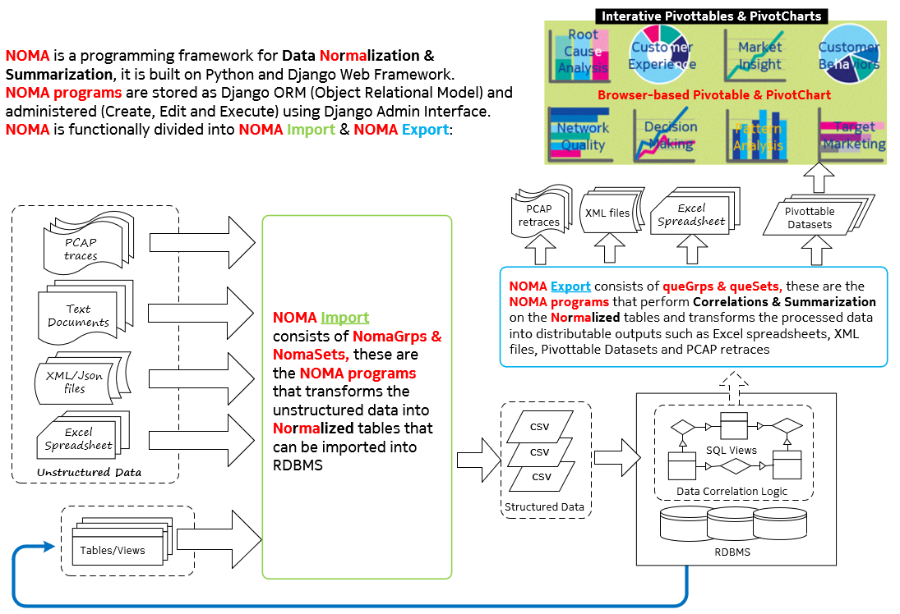
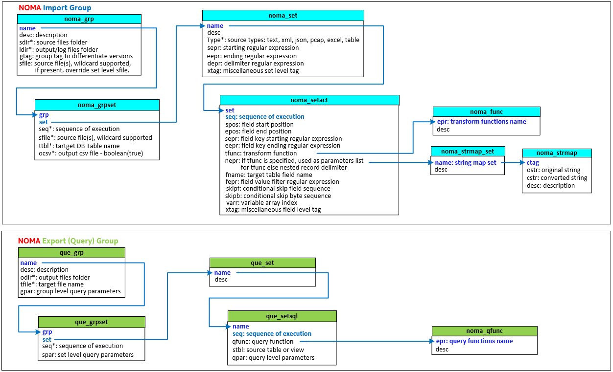

# NOMA

## Getting Started

These instructions will get you a copy of the project up and running on your local machine (Windows 7 or later) for development and testing purposes. See deployment for notes on how to deploy the project on a live system.

### Prerequisites

	1. Install Notepad++, add NppExec plugin
	2. Install Mariadb & HeidiSQL
	3. Create Database nomadb & xnaxdr (for multi-tenent create nomadb1 & xnaxdr1)
	4. Install Python 3.6.3
	5. Upgrade pip (py -m pip install --upgrade pip)
	6. install redis (Redis-x64-3.2.100.msi) for Windows (run as service)
	   https://github.com/MicrosoftArchive/redis/releases
	7. Install Git (git-scm.com)

### Installing

	8. Git clone github.com/ckhu2020/xna2
	9. Install virtualenv (py -m pip install --user virtualenv)
	10. Create virtual environment named sera_venv in folder pyenvs/sera/
	11. Activate virtual environment sera_venv (pyvenvs/sera/sera_venv/Scripts/activate)
	12. cd to /sera/xna2, run pip install -r noma_dependencies.xtx
	13. To execute NOMA scripts in Notepad++, add in NppExec Execute...
	    cmd /k C:\pyvenvs\sera\sera_venv\Scripts\activate & python "$(FILE_NAME)" & deactivate & exit
	14. Download dash_pivottable from https://github.com/xhlulu/dash_pivottable. Copy dash_pivottable folder to 
	    pyvenvs/sera/sera_venv/Lib/site-packages
	15. Create data folder (sera/data/nomasftp/uploads & downloads)
	16. Update settings.ini (using settings.ini.example as template)
	17. Create a migrations folder under xna2/noma and create an empty  __init__.py inside
	18. Launch Powershell, activate sera_venv, Run python manage.py makemigrations,  python manage.py migrate
	19. Run HeidiSQL to check NOMA ORM tables are created
	20. Under sera_venv, Run python manage.py createsuperuser
	21. Under sera_venv, Run python manage.py collectstatic 
	    (this will collect all noma static files under settings.STATIC_ROOT)
	22. Under sera_venv, Run python manage.py runserver
	23. Launch anonther Powershell, activate sera_venv, Run celery -A xna2 worker -l info
	24. Open Chrome browser: 127.0.0.1:8000/noma, login using superuser created in step-20
	25. In developer mode (i.e. runserver and DEBUG=True), copy settings.STATIC_ROOT/dash to xna2/noma/static/dash
	26. Run NOMA Query Group Dash_Pivot_Datasets, if Dash Pivottable is not loading, use Chrome developer tool 
	    (ctrl+shift+i) to check the console errors and 
	    correct the dash static files versioning in xna2.noma/static/dash according to the console errors mesages

## NOMA API ORM Specification

## Deployment for Production

NOMA can be deployed as cloud-based service. The deployment guide is still a work in progress. Please contact the author for consulting serivces.

## Contributing

Should you wish to contribute to this repository, please first discuss the change you wish to make via issue, email, or any other method with the owners of this repository

## Authors

* **Hu Chee Kiong** - *Initial work* - [CHEEHU](https://github.com/CHEEHU)

## License

This project is licensed under the MIT License - see the [LICENSE.md](LICENSE.md) file for details

## Acknowledgments

NOMA is standing on the shoulders of giants. All the heavylifiting are done by the giants listed (but not limited to) below:

* Python ecosystem (for the full list of depenencies, see [noma_dependencies.txt](noma_dependencies.txt) file)
* MariaDB and HeidiSQL
* Django Web Framework
* Plotly-Dash and react-pivottable
* Nginx and Gunicorn
* CentOS
* Notepad++ with NppExec plugin
* Celery + Redis
* git-scm.com

NOMA relies heavily on codes contributed by others in the open source community, special thanks to:

1. Django-Plotly-Dash and react-pivottable:
   * https://github.com/plotly/react-pivottable
   * https://github.com/xhlulu/dash_pivottable
   * https://github.com/GibbsConsulting/django-plotly-dash

2. celery & redis ssynchronous task execution:
   * https://rakibul.net/django-celery-1
   * https://medium.com/@markgituma/using-django-2-with-celery-and-redis-21343284827c
   * https://computingforgeeks.com/configure-celery-supervisord-centos-7-django-virtualenv/

3. django-inline-admin-extensions
   * Django admin interface page with tabularinline will become slow to load when the list of tabular items become too long (> 30 items). 
     The solution is to add pagination (with 20 items per page) to the tabularinline. After googling around, a working solution is found at:
     https://github.com/ctxis/django-inline-admin-extensions
